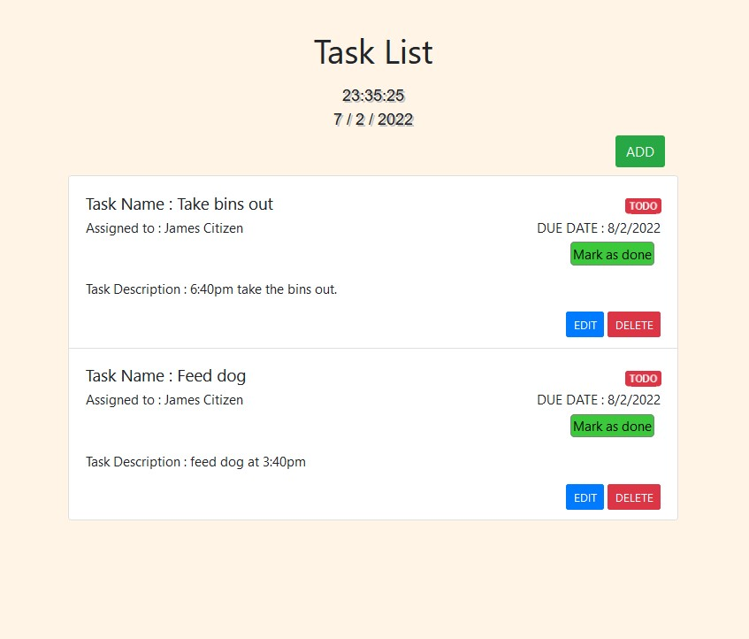

# 🌟 Welcome to Jordan, Elias and Paramita final project 🌟

📝 For more information please see [Jr Web Developer Final Project - Task Planner Web App](https://github.com/workForClass/final-jwd7)

📝 You can the see the rubric by clicking [here](https://docs.google.com/spreadsheets/d/1oKMVurjg8SW7cRU4-NwUxTxSvav4l5_W7yvDCHd3DKo/edit#gid=1124211828)

## Languages being used ℹ️

-  HTML 
-  JavaScript
-  CSS

## Preview of the Task Planner

## Code formatting used ℹ️

- Prettier code formatter
- Typescript & JavaScript Language Features

## Programs used ℹ️

- Visual Studio Code
- GitBash

---
